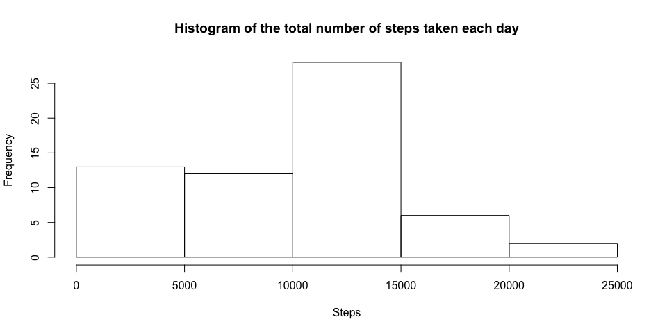
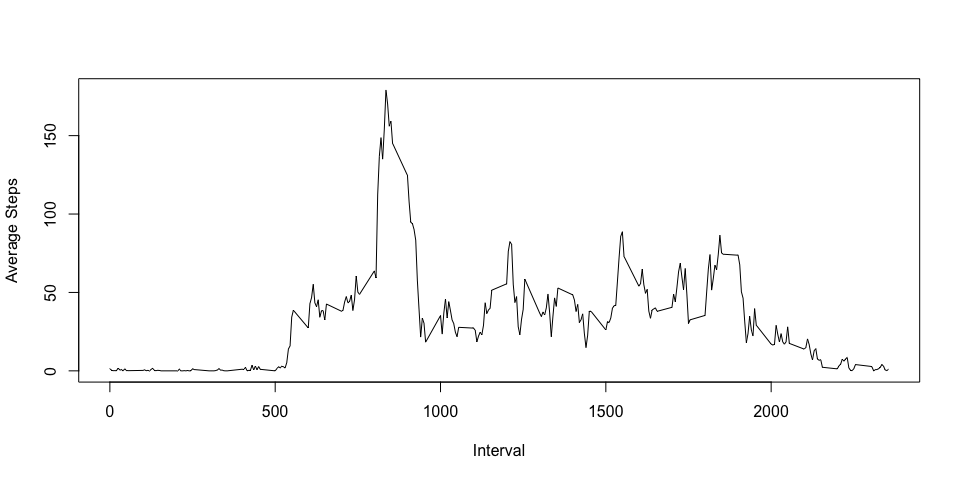
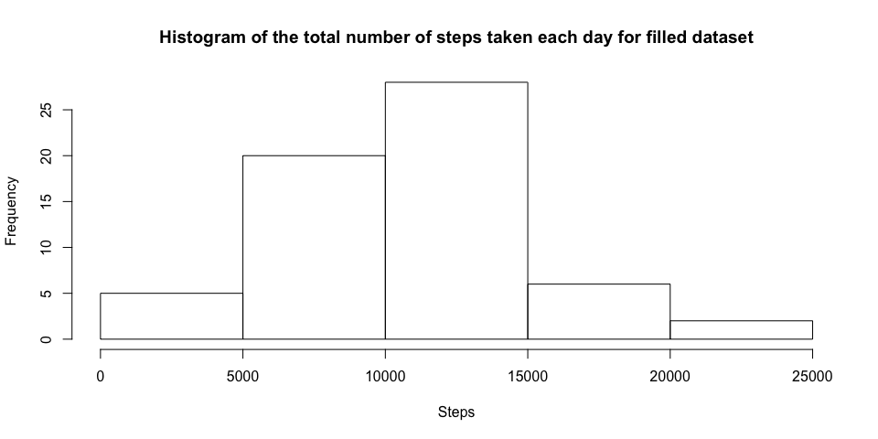
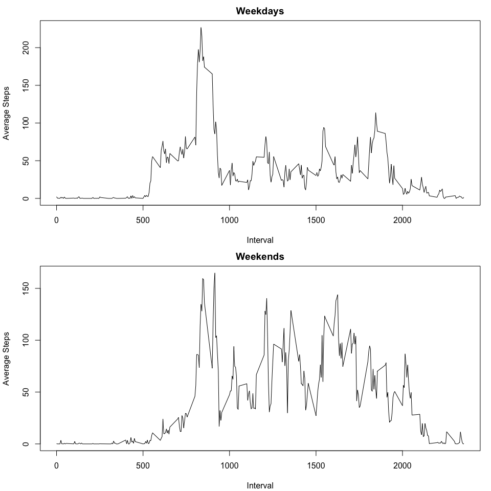

# Reproducible Research: Peer Assessment 1


## Loading and preprocessing the data


```r
if (!file.exists("activity.csv")) {
    unzip("activity.zip")
}

activity <- read.csv("activity.csv", header = TRUE, nrows = 17568, colClasses = c("numeric", "Date", "numeric"))
```


## What is mean total number of steps taken per day?

Computing sum of steps for each of the day and drawing a histogram.

```r
stepsPerDay <- tapply(activity$steps, activity$date, sum, na.rm = TRUE)
hist(x = stepsPerDay, xlab = "Steps", main = "Histogram of the total number of steps taken each day")
```

 

Let's see what's mean and median of computed data.

```r
mean <- mean(stepsPerDay)
```


```r
median <- median(stepsPerDay)
```

_Mean_ and _median_ of total number of steps taken per day are equals 9354.2295082 and 1.0395\times 10^{4} respectively.

## What is the average daily activity pattern?

Calculating average number of steps across all days.

```r
stepsPerInterval <- tapply(activity$steps, as.factor(activity$interval), sum, na.rm = TRUE)
intervalsPerDay <- length(split(activity$date, activity$date))
stepsAverage <- stepsPerInterval / intervalsPerDay
```

Time series plot of average steps in each interval across all days.

```r
intervals <- unique(activity$interval)
plot(x = intervals,stepsAverage, type="l", xlab = "Interval", ylab = "Average Steps")
```

 

Interval that contains maximum number of steps.

```r
intervals[which.max(stepsAverage)]
```

```
## [1] 835
```

## Imputing missing values

```r
missingValuesRows <- sum(!complete.cases(activity))
```
Total number of missing values in data set equals to 2304.

As we already have daily activity pattern let's fill each missing value with average of corresponding interval. New dataset will call as `completeActivity`.

```r
completeActivity <- activity
completeActivity$steps <- ifelse(is.na(activity$steps), stepsAverage, activity$steps)
```

The same as previous this histogram will show the difference between two datasets.

```r
completeStepsPerDay <- tapply(completeActivity$steps, completeActivity$date, sum, na.rm = TRUE)
hist(x = completeStepsPerDay, xlab = "Steps", main = "Histogram of the total number of steps taken each day for filled dataset")
```

 


```r
completeMean <- mean(completeStepsPerDay)
```


```r
completeMedian <- median(completeStepsPerDay)
```

_Mean_ and _median_ of total number of steps taken per day for filled datasets are equals 1.0581014\times 10^{4} and 1.0395\times 10^{4} respectively.

```r
abs(mean - completeMean)
```

```
## [1] 1226.784
```


```r
abs(median - completeMedian)
```

```
## [1] 0
```
So the value of median has not changed but the value of mean almost equals to median. That's because `NA`s presented as `0`s by default in source dataset. After filling it by average value sample mean came closer to median.

## Are there differences in activity patterns between weekdays and weekends?

Introducing new variable for indicating type of the day: `weekday` or `weekend`.

```r
weekday <- c("Mon", "Tue", "Wed", "Thu", "Fri")
weekend <- c("Sat", "Sun")
completeActivity$daytype <- as.factor(ifelse(weekdays(completeActivity$date, abbreviate = TRUE) %in% weekend, "weekend", "weekday"))
```

Splitting by `daytype` and finding average.

```r
splittedByDay <- split(completeActivity, completeActivity$daytype)
splittedByInterval <- lapply(splittedByDay, function (x) { split(x, x$interval) })

stepsAverageWeekdays <- sapply(splittedByInterval$weekday, function (x) { mean(x$steps) })
stepsAverageWeekends <- sapply(splittedByInterval$weekend, function (x) { mean(x$steps) })
```

Activity pattern plot.

```r
par(mfcol = c(2, 1), mar = c(4.1, 4.1, 2.1, 1.1))
plot(x = intervals, stepsAverageWeekdays, type = "l", xlab = "Interval", ylab = "Average Steps", main = "Weekdays")
plot(x = intervals, stepsAverageWeekends, type = "l", xlab = "Interval", ylab = "Average Steps", main = "Weekends")
```

 
As we can see on weekends there are more activity than on weekdays. May be because of work? :)
